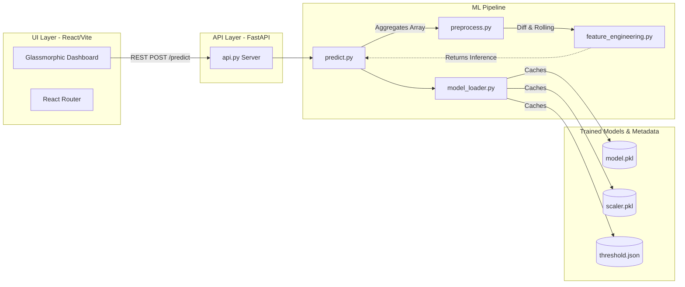
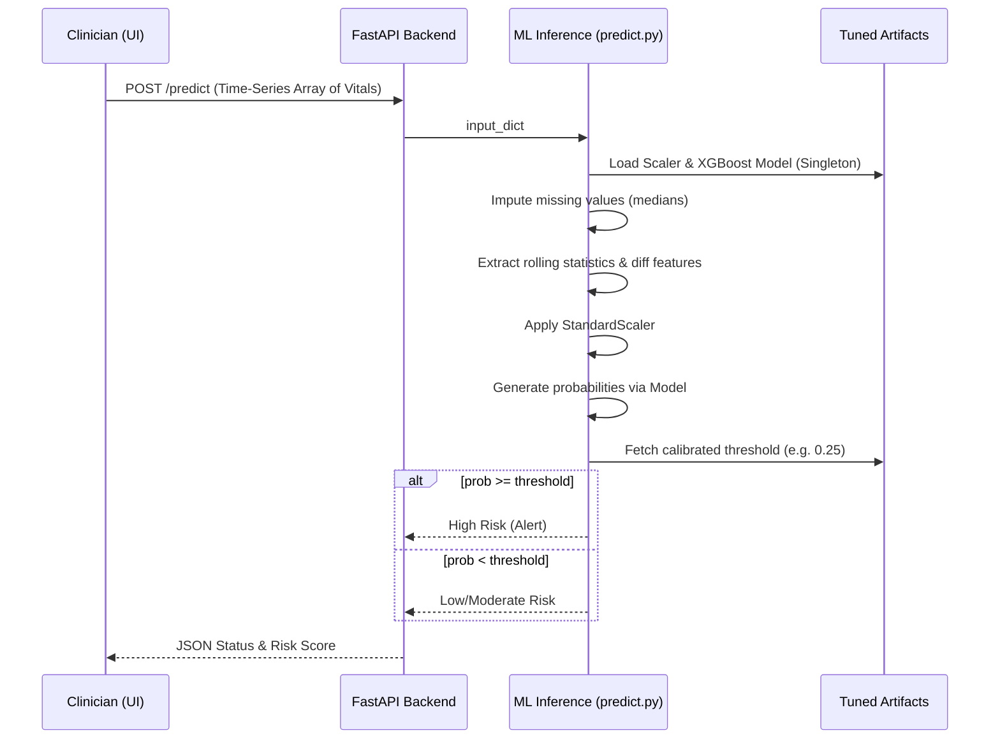

# 🧬 SepsisNova: Predictive Clinical Intelligence

[](https://react.dev)
[](https://fastapi.tiangolo.com)
[](https://vitejs.dev)
[](https://tailwindcss.com)
[](https://opensource.org/licenses/MIT)

**SepsisNova** is a state-of-the-art, full-stack predictive diagnostic application. It seamlessly bridges advanced Machine Learning pipelines with a luxurious, high-performance web interface designed for Intensive Care Unit (ICU) clinical teams.

---

## 1. Project Overview

### **The Problem**
Sepsis is a life-threatening systemic response to infection. Every hour of delayed treatment drastically increases patient mortality. Identifying subtle warning signs across multiple vital signals in real-time is challenging for overloaded medical staff.

### **Purpose & Core Functionality**
SepsisNova serves as an early-warning system. By processing time-series vital signs (Heart Rate, O2 Saturation, Temperature, Blood Pressure, Respiration), the system's underlying Machine Learning models can detect impending sepsis hours before clinical onset. 

### **Target Users**
- **ICU Nurses & Clinicians:** Real-time patient monitoring and rapid risk assessment.
- **Hospital Administrators:** Retrospective analytics on ICU sepsis incident rates and model efficiency boundaries.

---

## 2. Technical Architecture

### High-Level System Architecture


---

## 3. Workflow & Pipelines

### Application & Inference Workflow


---

## 4. Codebase Breakdown

```text
Sepsis_Model/
├── api.py                      # FastAPI server & route controllers
├── main.py                     # CLI entry point (training and isolated testing)
├── model/                      # Core Machine Learning logic
│   ├── train.py                # Pipeline for training multi-model ensembles
│   ├── predict.py              # Centralized inference ingestion pipeline
│   ├── preprocess.py           # Missing value imputation logic
│   ├── feature_engineering.py  # Calculates rate-of-change and temporal stats
│   └── model_loader.py         # Singleton pattern managing memory cache for PKL models
├── artifacts/                  # Generated outputs (model.pkl, scaler.pkl, threshold.json)
├── frontend/                   # React + Vite UI Codebase
│   ├── src/
│   │   ├── components/         # Premium luxury UI components (Preloader, Navbar, Footer)
│   │   ├── pages/              # Routing views: Home, Predict, Dashboard
│   │   ├── hooks/              # Custom context (usePrediction, useAnalytics)
│   │   └── index.css           # Global Tailwind configurations + Lexend Font
│   └── package.json            # Node.js dependencies
└── data/                       # Datasets (Ignored in Git via .gitignore)
```

**Architectural Decisions:**
- **Decoupled Frontend/Backend:** FastAPI handles the heavy Python data transformations while React drives the immersive framer-motion DOM independently.
- **Singleton Pattern (ML):** Evaluated strictly via `model_loader.py` to ensure large `model.pkl` files are localized centrally and loaded into memory exactly *once*, bypassing high latency on continuous concurrent `/predict` queries.
- **Threshold Calibration:** The default standard probability is eschewed in favor of `threshold.json` to prioritize maximum *Sensitivity*, identifying potential cases significantly earlier than basic ML architectures.

---

## 5. Installation & Setup

### Prerequisites
- **Python 3.9+** (For the Model/Backend Pipeline)
- **Node.js 18+** (For the React/Tailwind Frontend)

### Backend Deployment
1. **Clone and setup an isolated python environment:**
   ```bash
   git clone https://github.com/your-username/SepsisNova.git
   cd SepsisNova
   python -m venv .venv
   ```
2. **Activate the Environment:**
   - Windows: `.venv\Scripts\activate`
   - Linux/Mac: `source .venv/bin/activate`
3. **Install Requirements:**
   ```bash
   pip install -r requirements.txt
   ```
4. **Start the API Server:**
   ```bash
   uvicorn api:app --reload --port 8000
   ```

### Frontend Deployment
1. **Navigate and Install Node modules:**
   ```bash
   cd frontend
   npm install
   ```
2. **Launch Development Server:**
   ```bash
   npm run dev
   ```
3. Visit `http://localhost:5173` to interact with the system. *(Ensure the backend runs simultaneously to allow data fetching).*

---

## 6. API Reference

### `POST /predict`
Processes an array of hourly or minute-by-minute patient observations to capture time-dependent features indicating sudden deterioration.

**Request Body** (`application/json`):
```json
{
  "data": [
    { "HR": 85, "O2Sat": 98, "Temp": 36.5, "SBP": 120, "MAP": 70, "DBP": 65, "Resp": 18 },
    { "HR": 95, "O2Sat": 94, "Temp": 37.8, "SBP": 105, "MAP": 60, "DBP": 50, "Resp": 24 }
  ]
}
```
**Success Response** (`200 OK`):
```json
{
  "prediction": [1],
  "probability": 0.42,
  "threshold": 0.25,
  "risk_level": "High Risk",
  "alerts": ["Risk escalating rapidly."]
}
```

### `GET /analytics`
Retrieves generalized macroscopic platform data.
**Success Response** (`200 OK`):
```json
{
  "total_predictions": 12450,
  "high_risk_percentage": 14.2,
  "average_score": 0.35
}
```

---

## 7. Tech Stack

### Backend
- **Python & FastAPI:** Robust, high-speed asynchronous REST architecture.
- **Pandas & NumPy:** In-memory vectorization and time-series DataFrame mutation.
- **Scikit-Learn & XGBoost:** Distributed, ensemble-based gradient boosting models.

### Frontend
- **React 19 & Vite 8:** Ultra-fast HMR and streamlined component structures.
- **Tailwind CSS v4:** Modern, utility-first UI styling.
- **Framer Motion:** Cinematic physics-based entry animations, glassmorphic hover interactions.
- **Lucide React & Recharts:** Minimalist iconography and interactive telemetry data visualization.

---

## 8. Additional Considerations

### 🖼️ UI Previews
*(Insert Screenshots Below)*
- [x] Preloader & Floating Navbar
- [x] Cinematic Home Layout
- [x] Interactive Prediction Dashboard

### ⚡ Performance & Security
- **Predictive Velocity:** Aggregation and computation operate at <100ms per patient, capable of functioning seamlessly behind a web-hook stream from hospital EMR platforms.
- **Git Protections:** Robust `.gitignore` configuration isolates massive >150MB native datasets and prevents accidental security key or raw patient record pushes.

### 🔮 Future Improvements
- [ ] Connect the `GET /analytics` framework to a persistent PostgreSQL/Supabase database instead of utilizing mock data.
- [ ] Extend feature engineering calculations (e.g. `feature_engineering.py`) to encompass longitudinal historical EMR laboratory indicators, not exclusively live vitals.
- [ ] Containerize via Docker for abstracted Kubernetes scaling. 

---

> **Copyright © 2026 SepsisNova Inc. All Rights Reserved.**
